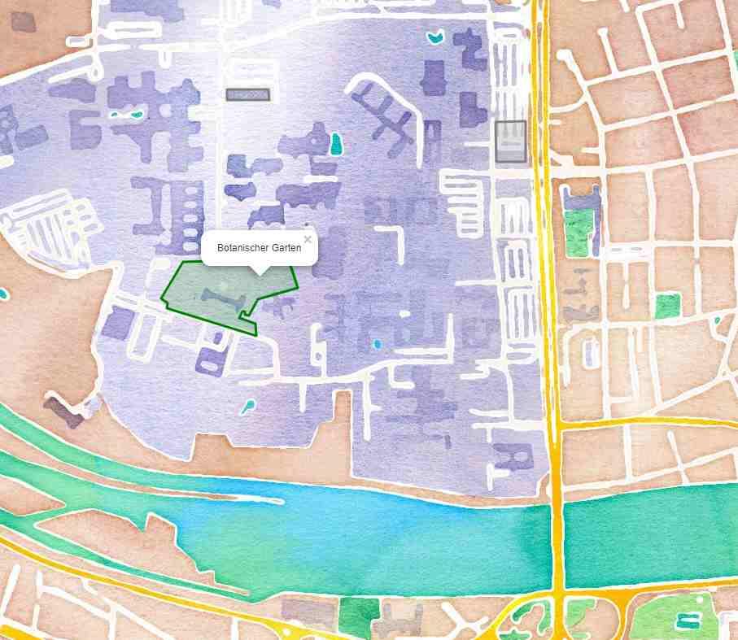

# WebGIS

Tutorial-Repository für das Seminar WebGIS

# Wie trägt man einen neuen Ort auf der Karte ein?

1. Webseite ausprobieren:
    1. Das Repository *forken*
    2. Den eigenen *Fork* *clonen* mit `git clone https://github.com/BENUTZERNAME/webgis`
    3. Die Webseite ausprobieren und nach einem geeigneten neuen Ort suchen
2. Vorbereitung:
    1. Ein *Issue* auf *github.com* erstellen mit einer genauen Beschreibung, was geändert werden soll und warum
        Dabei soll auch überprüft werden, ob diese Änderung nicht schon von einer anderen Gruppe vorgenommen wird
    2. Einen *Featurebranch* erstellen mit `git branch feature-NAME` (z.B. `git branch feature-mensa`)
    3. Auf den *Branch* wechseln mit `git checkout BRANCHNAME` (z.B. `git checkout feature-mensa`)
3. Die Änderung vornehmen:
    1. Den Ort beschreiben
        1. Die Datei `places/_template.js` kopieren und *DIE KOPIE* nach dem Ort benennen (z.B. `places/mensa.js`)
        2. In der Funktion `add_polygon` einen benutzerfreundlichen Namen eintragen
        3. In der Funktion `add_polygon` eine [Farbe](https://www.w3schools.com/cssref/css_colors.asp) für das Polygon eintragen
        4. Die Eckpunkte des Polygons in Form von Latitude/Longitude-Tupeln eintragen
    2. Den Ort registrieren
        1. In der Datei `index.html` den Ort registrieren wie im Kommentar beschrieben
        2. Den Kommentar dabei nicht löschen
4. Testen:
    1. Seite neuladen (`STRG+F5`) und Ergebnis testen
    2. Sicherstellen, dass ansonsten keine Änderungen vorgenommen wurden mit `git diff`
5. Ergebnis versionieren und hochladen:
    1. Die neue Datei und die geänderte Datei *stagen* mit `git add index.html places/DATEINAME.js`
    2. Die Dateien *committen* mit `git commit -m "HINWEIS, WAS GENAU GEÄNDERT WURDE (MIT REFERENZ AUF ISSUE)"`
    3. Den Commit *pushen* mit `git push -u origin BRANCHNAME`
    4. Pull-Request auf *github.com* erstellen und dabei das Issue referenzieren

